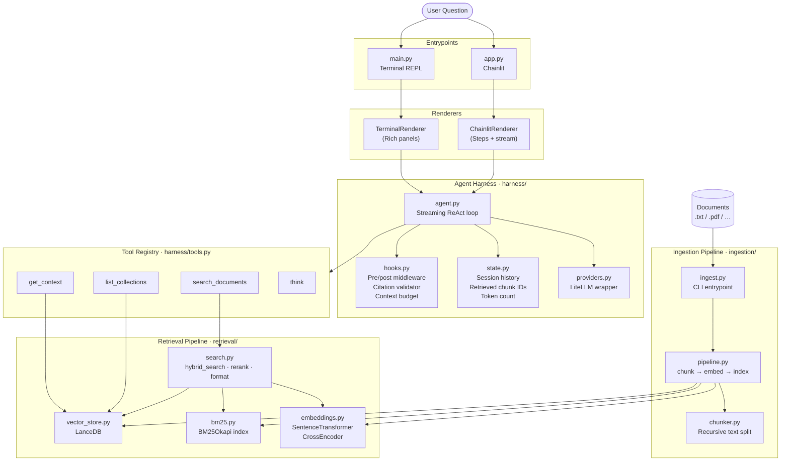

# RAG Agent Harness

An agentic retrieval-augmented generation (RAG) system that reasons over unstructured documents using a streaming ReAct loop. The agent autonomously decides when and how to search, iteratively refines queries, and cites every factual claim with a chunk ID.

## Features

- **Hybrid search** — BM25 + semantic (cosine) with Reciprocal Rank Fusion (RRF)
- **Cross-encoder reranking** — `ms-marco-MiniLM` reranks candidates before the LLM sees them
- **Streaming ReAct loop** — tool calls and answer tokens stream to the UI in real time
- **Multi-provider** — swap between Anthropic, OpenAI, and Gemini with one flag
- **PDF + text ingestion** — `.txt`, `.md`, and `.pdf` (parsed locally via `liteparse`, no API key)
- **Context budget** — hard cap on retrieved tokens prevents prompt overflow
- **Citation validator** — post-hook rejects hallucinated chunk IDs before the answer reaches the user
- **Two UIs** — Rich terminal (default) and Chainlit browser UI

---

## System Design



---

## Project Structure

```
rag-agent-harness/
├── harness/
│   ├── agent.py          # Core streaming ReAct loop
│   ├── providers.py      # LiteLLM wrapper + provider registry
│   ├── tools.py          # Tool implementations + JSON schemas
│   ├── hooks.py          # Pre/post middleware, citation check, budget
│   └── state.py          # Session state: history, chunk IDs, token count
│
├── retrieval/
│   ├── search.py         # hybrid_search(), rerank_results(), format_results()
│   ├── vector_store.py   # LanceDB: insert, cosine search, neighbor fetch
│   ├── bm25.py           # BM25 index: build, persist, search
│   └── embeddings.py     # SentenceTransformer + CrossEncoder wrappers
│
├── ingestion/
│   ├── chunker.py        # Recursive character text splitter
│   ├── pipeline.py       # chunk → embed → LanceDB + BM25
│   └── ingest.py         # CLI: python -m ingestion.ingest --path ./docs
│
├── renderers/
│   ├── base.py           # BaseRenderer — abstract async interface
│   ├── terminal.py       # Rich: panels, spinners, streaming answer
│   └── chainlit.py       # Chainlit: Steps + stream_token
│
├── config.py             # All settings (provider, k, paths, models)
├── main.py               # Terminal entrypoint
├── app.py                # Chainlit entrypoint
└── sample_docs/          # Example documents for testing
```

---

## Quickstart

### 1. Install dependencies

```bash
uv venv
uv pip install -e .          # installs everything in pyproject.toml

# Optional: PDF ingestion support (parsed locally, no API key)
uv pip install liteparse
```

### 2. Configure API keys

```bash
cp .env.example .env
# edit .env and add your key(s)
```

```env
ANTHROPIC_API_KEY=sk-ant-...
OPENAI_API_KEY=sk-...         # optional
GEMINI_API_KEY=...            # optional
```

### 3. Ingest documents

```bash
# Ingest a directory of .txt files into a named collection
python -m ingestion.ingest --path ./sample_docs --collection docs

# Ingest a single file
python -m ingestion.ingest --path report.pdf --collection reports
```

### 4. Ask questions

```bash
# Single question (terminal)
python main.py "What was ACME's Q3 revenue?"

# Interactive REPL
python main.py

# Different provider
python main.py --provider openai-fast "What are the key risks mentioned?"

# Browser UI
chainlit run app.py
```

---

## Providers

| Key | Model | Notes |
|---|---|---|
| `gemini-fast` | gemini-2.5-flash | **Default** — fast and cheap |
| `gemini-smart` | gemini-2.5-pro | |
| `anthropic-fast` | claude-haiku-4-5 | |
| `anthropic-smart` | claude-sonnet-4-6 | Extended thinking enabled |
| `openai-fast` | gpt-4o-mini | |
| `openai-smart` | gpt-4o | |

---

## Agent Tools

| Tool | Description |
|---|---|
| `list_collections` | List all indexed document collections |
| `search_documents` | Hybrid BM25+semantic search with reranking |
| `get_context` | Fetch a chunk plus N neighbors for deeper reading |
| `think` | Scratchpad for multi-hop reasoning before answering |

---

## How It Works

1. **Ingestion** — Documents are split into overlapping chunks, embedded with `BAAI/bge-small-en-v1.5`, stored in LanceDB, and indexed by BM25.
2. **Query** — The agent receives a question and enters a streaming ReAct loop (max 10 iterations).
3. **Search** — `search_documents` runs hybrid retrieval: BM25 keyword scores and cosine similarity scores are fused with RRF, then reranked by a cross-encoder.
4. **Context expansion** — The agent can call `get_context` to retrieve neighboring chunks around a promising result.
5. **Answer** — Once the agent has enough evidence it writes a final answer. A post-hook validates that every `[chunk_id]` citation was actually retrieved; hallucinated IDs trigger a revision loop.

> For a detailed, code-linked walkthrough of both the ingestion and answering pipelines, see **[PIPELINE.md](PIPELINE.md)**.

---

## Configuration

Key settings in `config.py`:

| Setting | Default | Description |
|---|---|---|
| `provider` | `gemini-fast` | LLM provider key |
| `search_k` | `10` | Candidates before reranking |
| `rerank_top_k` | `5` | Results after reranking |
| `context_window_size` | `2` | Neighbor chunks in `get_context` |
| `max_retrieved_tokens` | `8000` | Hard context budget |
| `embedding_model` | `BAAI/bge-small-en-v1.5` | Local embedding model |
| `reranker_model` | `cross-encoder/ms-marco-MiniLM-L-6-v2` | Local reranker |
| `lance_db_path` | `./corpus.lance` | Vector store path |
